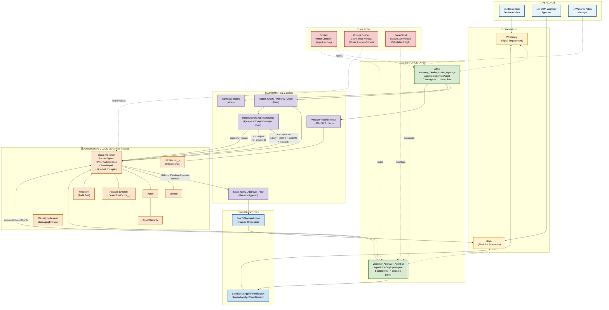
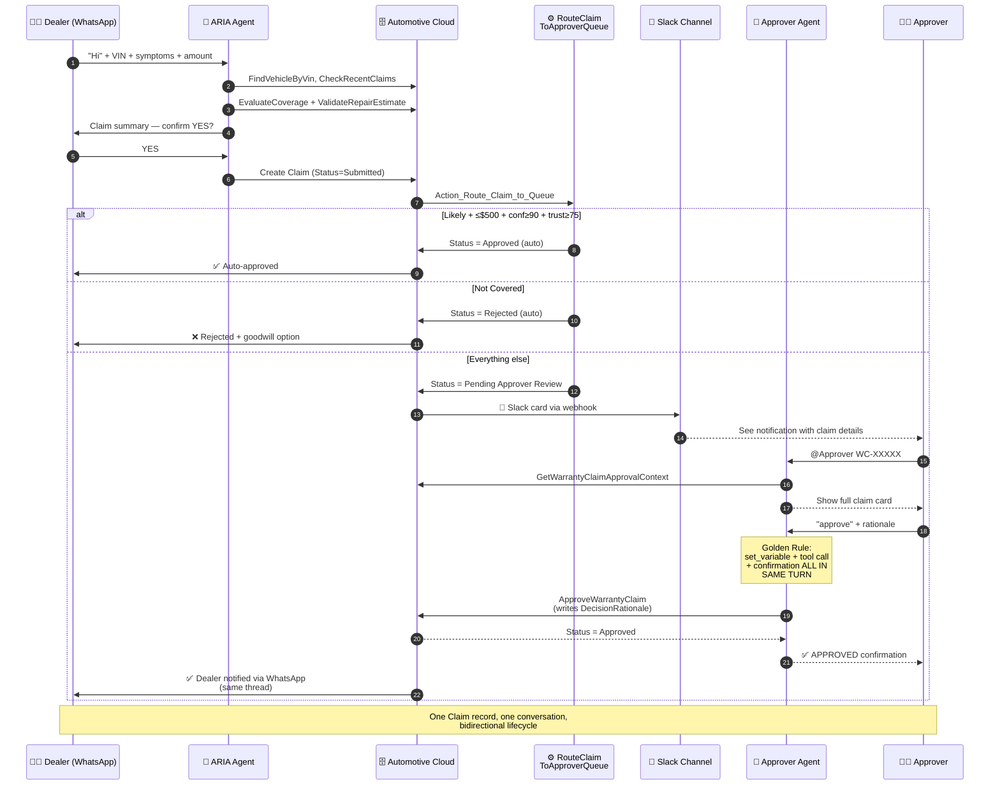
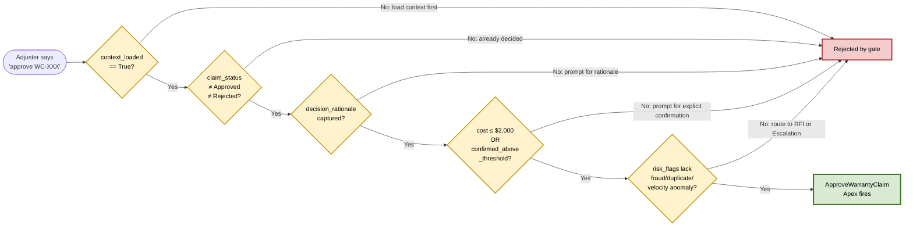

# Electra Cars Warranty Claim Agent — Architecture Diagrams

Two Mermaid diagrams for your pitch deck and documentation. Render natively in
GitHub README, Notion, Confluence, and most modern Markdown viewers. To export
as PNG for slides, use [mermaid.live](https://mermaid.live) — paste the code,
download as SVG or PNG.

---

## Diagram 1 — System Architecture (one-slide overview)



---

## Diagram 2 — Happy Path Sequence (demo slide)



---

## Diagram 3 — Deterministic Guardrails (defense-in-depth)



---

## How To Use These in Your Pitch Deck

### Slide 3 (Architecture Overview)
- Paste Diagram 1
- Talking track: *"Two agents, three channels, one Claim record as source of truth. Automotive Cloud as system of record, Agentforce for conversational AI, standard Slack-for-Salesforce bridge for OEM review, Digital Engagement for dealer WhatsApp. No custom middleware."*

### Slide 5 or 6 (Demo Replay Slide)
- Paste Diagram 2 (sequence)
- Talking track: *"Here's what just happened in the demo — claim submitted, evaluated, auto-routed, approved, dealer notified. Every step captures rationale for audit. End-to-end in under 2 minutes."*

### Slide 7 (Trust & Safety)
- Paste Diagram 3
- Talking track: *"Five `available when` gates in Apex, not prompt discipline. Even the AI can't override the $2,000 threshold, can't re-approve a decided claim, can't skip the fraud check. Deterministic guardrails are the difference between hackathon demo and production-ready."*

---

## To Export As Images

1. Go to https://mermaid.live
2. Paste any diagram block (without the ```` ```mermaid ```` fence)
3. **Export** → PNG or SVG
4. Drop into your slide

Or using mermaid-cli:
```bash
npm install -g @mermaid-js/mermaid-cli
mmdc -i diagram.mmd -o diagram.png -b transparent -w 2400 -H 1800
```
