# Electra Warranty Intelligence

AI-driven warranty prior-authorization platform for EV manufacturers, built on Salesforce Automotive Cloud, Agentforce, and Data Cloud.

[](https://www.salesforce.com/products/automotive-cloud/)
[](https://www.salesforce.com/agentforce/)
[](https://www.salesforce.com/data/)
[](#)
[](LICENSE)

---

## Overview

An EV manufacturer's dealer network submits thousands of warranty prior-authorization requests every day. The traditional pipeline — emailed PDF forms reviewed by a small team of OEM approvers — averages 24–72 hour turnaround and consumes most of the approvers' time on data entry rather than judgment.

This project replaces that pipeline end to end. Dealers submit claims through a conversational agent embedded in their portal. Every claim is auto-classified at the moment of submission against coverage rules, an AI risk verdict, the dealer's trust score, and Data Cloud vehicle telemetry. Low-risk claims clear in under thirty seconds, uncovered claims are rejected with a personalized message, and everything else is enriched and routed to an OEM approver in Slack — where a second agent handles approve, reject, clarify, and goodwill workflows.

## Architecture

```mermaid
flowchart LR
    Dealer["Dealer<br/>(service advisor)"]
    ARIA["ARIA<br/>(Agentforce service agent)"]
    Claim["Claim record<br/>(Automotive Cloud)"]
    Engine["Coverage Engine<br/>+ AI Verdict<br/>(Prompt Builder)"]
    Approver["Warranty Approver<br/>(Agentforce employee agent)"]
    Slack["Slack<br/>approver channel"]
    Outputs["PDF authorization · WhatsApp ·<br/>Customer notification · Trust-score recalc"]

    Dealer -- Web Chat / WhatsApp --> ARIA
    ARIA --> Claim
    Claim --> Engine
    Engine -- "auto-approve<br/>or auto-reject" --> Outputs
    Engine -- "queued for review" --> Slack
    Slack --> Approver
    Approver --> Outputs

    classDef agent fill:#D9EAD3,stroke:#38761D,stroke-width:2px,color:#000;
    classDef data fill:#FCE5CD,stroke:#B45F06,stroke-width:2px,color:#000;
    class ARIA,Approver agent
    class Claim,Engine,Outputs data
```



Detailed system, sequence, and guardrail diagrams: [`ARCHITECTURE_DIAGRAMS.md`](ARCHITECTURE_DIAGRAMS.md).

## Capabilities

**Dealer-facing intake (ARIA)**
- Conversational claim submission via the dealer portal Web Chat; WhatsApp also supported through Digital Engagement
- Slot-filling for VIN, symptom, part category, odometer, and cost across five to seven turns
- Photo upload with vision damage analysis
- Inline RFI handling: clarification requests from the approver thread back into the same conversation

**Auto-routing engine**
- Coverage Engine performs real-time AssetWarranty lookup
- AI verdict from a live Prompt Builder template invoked via `ConnectApi.EinsteinLLM`, with a deterministic rule-based fallback if the model is unavailable
- Routing logic: auto-approve when verdict is Likely *and* cost ≤ $500 *and* confidence ≥ 90 *and* dealer trust ≥ 75; auto-reject when coverage is Not Covered; queue otherwise

**Approver workflow (Slack-native)**
- Four decision paths: approve, reject, clarify, goodwill
- Rich context card combining AI verdict, historical precedent ("Of 12 similar claims in the last 90 days, 9 were approved"), vehicle telemetry from Data Cloud, and live dealer trust score
- Deterministic guardrails enforced in both the agent's reasoning and in Apex: status guards prevent re-decisioning of closed claims, an explicit confirmation gate sits in front of every approval over $2,000, and fraud / duplicate / velocity checks short-circuit before any DML

**Post-decision automation**
- Branded PDF authorization certificate via Visualforce → `ContentDistribution`, persisted on the Claim record
- Three-tier dealer notification: live Messaging Session push, Chatter audit fallback, retry handling
- Part-specific repair guidance generated on the fly by a second Prompt Builder template
- Customer (vehicle owner) notified separately with the same PDF link
- Dealer Trust Score recalculated by an Apex trigger on every decision

## Tech stack

**Salesforce products**
- Automotive Cloud — Vehicle, Asset, AssetWarranty, Account, Contact
- Agentforce — Service Agent (ARIA) + Employee Agent (Approver)
- Prompt Builder — three active templates, source-controlled in `genAiPromptTemplates/`
- Data Cloud — telemetry data stream, calculated insight, and Platform Event bridge into Salesforce
- Digital Engagement — WhatsApp messaging
- Experience Cloud — dealer portal hosting the Web Chat
- Slack for Salesforce — Agentforce channel binding and incoming webhook

**Platform features**
- Apex (30+ warranty classes), Apex Triggers, Platform Events
- Flow (orchestrator + record-triggered subflows)
- Visualforce + ContentDistribution for branded PDF generation
- Custom Objects, custom fields, formula fields, Lightning Web Components

**APIs**
- `ConnectApi.EinsteinLLM.generateMessagesForPromptTemplate` — live Prompt Builder invocation
- `EventBus.publish` — Platform Events for Data Cloud → Claim writeback
- `Invocable.Action` — agent action standard

## Repository layout

```
force-app/main/default/
├── aiAuthoringBundles/      Agentforce agents (ARIA + Approver)
├── classes/                  Apex — service, invocable, trigger handlers
├── triggers/                 Claim status + Platform Event triggers
├── flows/                    Orchestrator + record-triggered flows
├── genAiPromptTemplates/     Three live Prompt Builder templates
├── lwc/                      Lightning Web Components for the dealer portal
├── objects/                  Custom objects + field metadata
├── pages/                    Visualforce PDF page
├── permissionsets/           Agentforce + warranty user permissions
└── calculatedInsights/       Data Cloud calculated insight definition

scripts/
├── apex/                     Demo seeders + verification scripts
└── datacloud/                Sample telemetry CSV
```

## Setup

### 1. Deploy metadata

```bash
sf project deploy start -d force-app -o your-org-alias
```

### 2. Activate Prompt Templates

In Setup → Prompt Builder, activate the three deployed templates:

- `Claim_Risk_Verdict` — returns a JSON verdict (recommendation / confidence / summary) from the Claim context
- `Compose_Dealer_Rejection_Message` — empathetic rejection composer
- `Compose_Repair_Guidance_Message` — part-specific repair tips

### 3. Configure integrations

- **Slack** — install Slack for Salesforce and bind the Approver agent to the `#all-electra-cars-approvers` channel
- **WhatsApp** — configure a Digital Engagement messaging channel
- **Data Cloud** — upload `scripts/datacloud/telematics-events.csv` as a data stream

### 4. Seed demo data and verify

```bash
sf apex run -f scripts/apex/seed_demo_telemetry.apex -o your-org-alias
sf apex run -f scripts/apex/qa_full_suite.apex -o your-org-alias
sf apex run -f scripts/apex/verify_prompt_templates.apex -o your-org-alias
```

All assertions should pass and the three Prompt Templates should report `OK LIVE`.

## Demo flow

1. Dealer opens the dealer portal Web Chat and reports a claim — for example, *"VIN ELXDEMOFRD0800000, battery dead at 12k miles."* ARIA collects the symptom, odometer, and cost, then submits the claim.
2. The auto-router classifies the claim. Low-cost, high-confidence claims on trusted dealers auto-approve in under thirty seconds, with a PDF link delivered back to the dealer.
3. Higher-value or borderline claims arrive in the approver Slack channel as a rich context card. The approver replies in natural language: *"approve WC-00042, fault codes corroborate the diagnosis."* The decision is committed, the PDF is generated, and the dealer is notified in the same conversation.
4. Out-of-warranty claims are auto-rejected with a personalized rejection message composed by the dedicated Prompt Builder template — not a generic templated denial.

## License

Released under the [MIT License](LICENSE).
